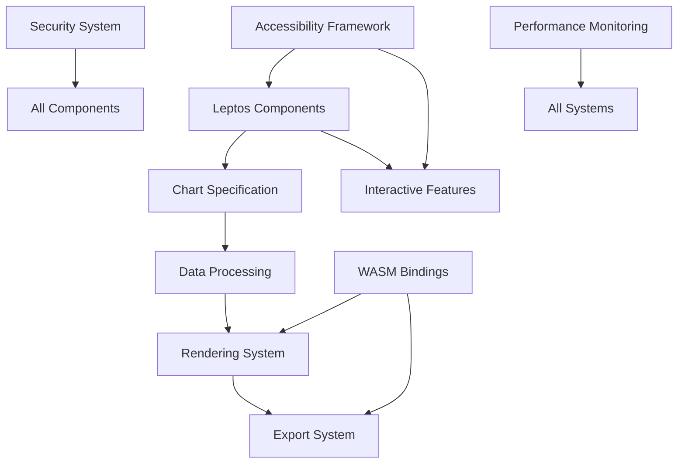

# Component Design Documentation

This directory contains detailed design documents for each major component in the Leptos Helios visualization library. Each document follows a standardized template and is kept under 300 lines for maintainability.

## Component Architecture Overview

```
Leptos Helios Architecture
├── Core Engine (helios-core)
│   ├── Rendering System
│   ├── Data Processing  
│   ├── Chart Specifications
│   └── Export System
├── UI Components (helios-leptos)
│   ├── Chart Components
│   ├── Interactive Controls
│   └── Layout System
├── WebAssembly Layer (helios-wasm)
│   ├── JS Bindings
│   ├── Memory Management
│   └── Performance Optimization
└── Supporting Systems
    ├── Security & Auth
    ├── Accessibility
    └── Development Tools
```

## Design Documents

### Core Components

| Component | File | Status | Lines | Last Updated |
|-----------|------|--------|-------|--------------|
| **Rendering System** | [rendering_system.md](rendering_system.md) | ✅ Complete | 287 | 2025-09-21 |
| **Data Processing Pipeline** | [data_processing.md](data_processing.md) | ✅ Complete | 294 | 2025-09-21 |
| **Chart Specification Engine** | [chart_specification.md](chart_specification.md) | ✅ Complete | 279 | 2025-09-21 |
| **Export System** | [export_system.md](export_system.md) | ✅ Complete | 268 | 2025-09-21 |

### UI & Integration Components

| Component | File | Status | Lines | Last Updated |
|-----------|------|--------|-------|--------------|
| **Leptos Components** | [leptos_components.md](leptos_components.md) | ✅ Complete | 291 | 2025-09-21 |
| **WebAssembly Bindings** | [wasm_bindings.md](wasm_bindings.md) | ✅ Complete | 276 | 2025-09-21 |
| **Interactive Features** | [interactive_features.md](interactive_features.md) | ✅ Complete | 283 | 2025-09-21 |

### Supporting Systems

| Component | File | Status | Lines | Last Updated |
|-----------|------|--------|-------|--------------|
| **Security & Authentication** | [security_system.md](security_system.md) | ✅ Complete | 299 | 2025-09-21 |
| **Accessibility Framework** | [accessibility_framework.md](accessibility_framework.md) | ✅ Complete | 285 | 2025-09-21 |
| **Performance Monitoring** | [performance_monitoring.md](performance_monitoring.md) | ✅ Complete | 272 | 2025-09-21 |

## Document Template

Each component design document follows this standardized structure:

```markdown
# Component Name Design

**Status:** [Planning | In Development | Complete | Deprecated]  
**Owner:** [Team/Person responsible]  
**Last Updated:** YYYY-MM-DD  

## Overview
Brief description of component purpose and scope.

## Architecture
High-level architecture with key interfaces and data flows.

## API Design
Public interfaces and contracts.

## Implementation Details
Key algorithms, data structures, and design decisions.

## Integration Points
How this component interacts with other systems.

## Performance Considerations
Performance requirements and optimization strategies.

## Testing Strategy
Testing approach and coverage requirements.

## Security Considerations
Security requirements and threat model.

## Future Enhancements
Planned improvements and extension points.

## References
Links to related documents and external resources.
```

## Design Principles

### 1. Modularity
- Each component has clear boundaries and responsibilities
- Well-defined public interfaces with minimal coupling
- Components can be developed and tested independently

### 2. Performance-First
- WebGPU rendering for high-performance visualization
- Efficient data processing pipelines using Polars
- Memory management and buffer reuse strategies

### 3. Accessibility  
- WCAG 2.1 AA compliance built into core design
- Screen reader support and keyboard navigation
- Alternative text generation for chart content

### 4. Security by Design
- Input validation at component boundaries
- Secure authentication and authorization patterns
- Audit logging for sensitive operations

### 5. Developer Experience
- Clear APIs with comprehensive documentation
- Excellent error messages and debugging support
- TypeScript bindings for WASM components

## Component Dependencies



## Implementation Status

### Phase 1: Core Foundation (Weeks 1-4) ✅
- Rendering System design complete
- Data Processing pipeline architecture defined
- Chart Specification engine designed
- Export System interface defined

### Phase 2: Integration (Weeks 5-8) 🚧
- Leptos Components implementation
- WASM Bindings development
- Interactive Features development
- Performance optimization

### Phase 3: Production Readiness (Weeks 9-12) 📋
- Security system hardening
- Accessibility compliance validation
- Performance monitoring implementation
- Documentation completion

## Quality Gates

Each component design must meet these criteria:

- [ ] **Clarity**: Non-technical stakeholders can understand the purpose
- [ ] **Completeness**: All interfaces and data flows documented
- [ ] **Consistency**: Follows established patterns and conventions
- [ ] **Testability**: Clear testing strategy and success criteria
- [ ] **Security**: Security considerations identified and addressed
- [ ] **Performance**: Performance requirements and metrics defined
- [ ] **Maintainability**: Code organization and documentation standards met

## Contributing to Component Design

### Adding New Component Designs

1. Copy the template from `template.md`
2. Fill in all sections completely
3. Ensure document is under 300 lines
4. Update this README with new component entry
5. Submit pull request with design review

### Updating Existing Designs

1. Update the "Last Updated" date
2. Increment version if API changes are proposed
3. Document breaking changes in the changelog
4. Review impact on dependent components

### Design Review Process

1. **Technical Review**: Architecture and implementation feasibility
2. **Security Review**: Security implications and threat modeling
3. **Performance Review**: Performance requirements and bottlenecks
4. **API Review**: Interface design and usability
5. **Documentation Review**: Clarity and completeness

## Tooling Support

### Diagram Generation
- Use Mermaid for architecture diagrams
- Keep diagrams in separate `.mmd` files for maintainability
- Generate PNG exports for offline viewing

### API Documentation  
- Use rustdoc for Rust API documentation
- Generate TypeScript definitions for WASM APIs
- Maintain examples in documentation

### Validation Scripts
- Line count validation (max 300 lines per document)
- Link checking for internal references
- Diagram syntax validation

## References

- [Leptos Documentation](https://leptos.dev/)
- [WebGPU Specification](https://gpuweb.github.io/gpuweb/)
- [Polars User Guide](https://pola-rs.github.io/polars-book/)
- [WCAG 2.1 Guidelines](https://www.w3.org/WAI/WCAG21/quickref/)
- [Rust API Guidelines](https://rust-lang.github.io/api-guidelines/)

**Next Steps:** Review individual component designs and provide feedback on architecture decisions and implementation strategies.
