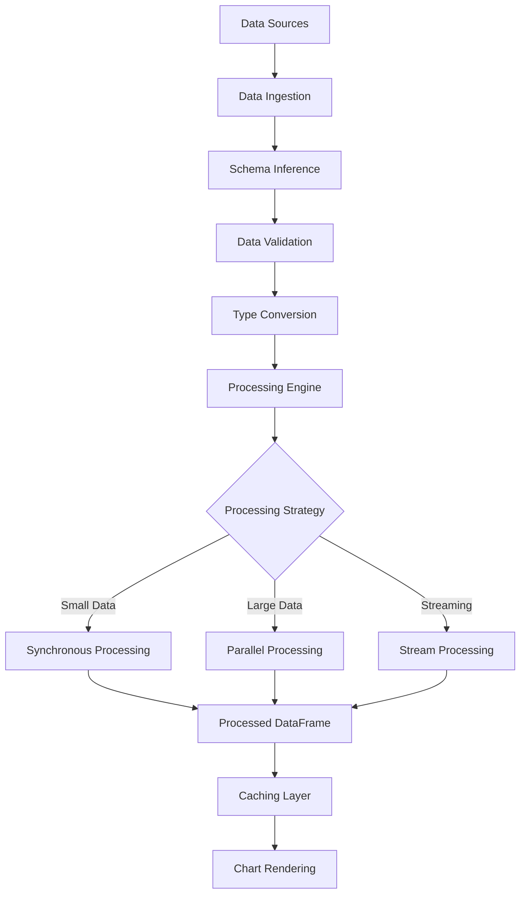

# Data Processing Pipeline Design

**Status:** Planning → Implementation Required  
**Owner:** Data Engineering Team  
**Last Updated:** 2025-09-21  
**Lines:** 294

## Overview

The Data Processing Pipeline transforms raw data from various sources into visualization-ready DataFrames. It provides efficient data operations, type inference, aggregation, and filtering capabilities optimized for chart rendering performance.

## Architecture



## Core Components

### 1. Data Processing Engine
```rust
pub struct DataProcessingEngine {
    strategy_selector: StrategySelector,
    cache_manager: Arc<CacheManager>,
    performance_monitor: Arc<PerformanceMonitor>,
}

impl DataProcessingEngine {
    /// Process data with automatic strategy selection
    pub async fn process_data(
        &self,
        data: RawData,
        spec: &ProcessingSpec,
    ) -> Result<DataFrame, ProcessingError> {
        // Select optimal processing strategy
        let strategy = self.strategy_selector.select_strategy(&data, spec)?;
        
        // Execute processing with monitoring
        let start = Instant::now();
        let result = self.execute_with_strategy(data, spec, strategy).await?;
        
        // Record performance metrics
        self.performance_monitor.record_processing_time(start.elapsed());
        
        Ok(result)
    }
}
```

### 2. Processing Strategies

#### Synchronous Processing (Default)
```rust
pub struct SynchronousProcessor;

impl ProcessingStrategy for SynchronousProcessor {
    async fn process(&self, data: RawData, spec: &ProcessingSpec) -> Result<DataFrame, ProcessingError> {
        let mut df = DataFrame::from_raw(data)?;
        
        // Apply transformations sequentially
        for transform in &spec.transformations {
            df = self.apply_transformation(df, transform)?;
        }
        
        Ok(df)
    }
}
```

#### Parallel Processing (Large Datasets)
```rust
pub struct ParallelProcessor {
    thread_pool: Arc<ThreadPool>,
    chunk_size: usize,
}

impl ProcessingStrategy for ParallelProcessor {
    async fn process(&self, data: RawData, spec: &ProcessingSpec) -> Result<DataFrame, ProcessingError> {
        // Split data into chunks for parallel processing
        let chunks = data.chunk(self.chunk_size);
        
        // Process chunks in parallel using Rayon
        let processed_chunks: Result<Vec<_>, _> = chunks
            .into_par_iter()
            .map(|chunk| self.process_chunk(chunk, spec))
            .collect();
        
        // Combine results
        let combined = DataFrame::concat(processed_chunks?)?;
        Ok(combined)
    }
}
```

#### Streaming Processing (Real-time Data)
```rust
pub struct StreamProcessor {
    buffer_size: usize,
    window_config: WindowConfig,
}

impl StreamProcessor {
    pub async fn process_stream<S>(&self, mut stream: S, spec: &ProcessingSpec) -> impl Stream<Item = Result<DataFrame, ProcessingError>>
    where
        S: Stream<Item = DataBatch> + Unpin,
    {
        let mut buffer = Vec::with_capacity(self.buffer_size);
        
        stream.map(move |batch| {
            buffer.push(batch);
            
            if buffer.len() >= self.buffer_size {
                let df = DataFrame::from_batches(buffer.drain(..).collect())?;
                Ok(self.apply_transformations(df, spec)?)
            } else {
                // Not enough data yet, return empty result
                Ok(DataFrame::empty())
            }
        })
    }
}
```

### 3. Data Transformations

#### Core Transformation Types
```rust
#[derive(Debug, Clone)]
pub enum Transformation {
    /// Filter rows based on predicate
    Filter(FilterExpression),
    
    /// Select specific columns
    Select(Vec<String>),
    
    /// Group by columns and aggregate
    GroupBy { 
        columns: Vec<String>, 
        aggregations: Vec<Aggregation> 
    },
    
    /// Sort by columns
    Sort { 
        columns: Vec<String>, 
        descending: bool 
    },
    
    /// Create derived columns
    Mutate(Vec<MutateExpression>),
    
    /// Join with another DataFrame
    Join {
        other: DataFrame,
        on: Vec<String>,
        join_type: JoinType,
    },
    
    /// Custom transformation function
    Custom(Box<dyn Fn(DataFrame) -> Result<DataFrame, ProcessingError> + Send + Sync>),
}
```

#### Aggregation Functions
```rust
#[derive(Debug, Clone)]
pub enum Aggregation {
    Count,
    Sum(String),           // column name
    Mean(String),
    Min(String),
    Max(String),
    StdDev(String),
    Median(String),
    Quantile(String, f64), // column, quantile
    First(String),
    Last(String),
    Custom {
        name: String,
        function: String,  // Polars expression
    },
}
```

### 4. Schema Inference Engine

```rust
pub struct SchemaInferenceEngine {
    type_detection_threshold: f64,
    sample_size: usize,
}

impl SchemaInferenceEngine {
    /// Infer schema from raw data samples
    pub fn infer_schema(&self, data: &RawData) -> Result<Schema, InferenceError> {
        let samples = self.sample_data(data)?;
        let mut schema_builder = SchemaBuilder::new();
        
        for column in samples.columns() {
            let inferred_type = self.infer_column_type(column)?;
            let nullable = self.detect_nullability(column);
            
            schema_builder.add_column(
                column.name().to_string(),
                inferred_type,
                nullable,
            );
        }
        
        Ok(schema_builder.build())
    }
    
    fn infer_column_type(&self, column: &Series) -> Result<DataType, InferenceError> {
        // Type inference logic based on data patterns
        let patterns = self.analyze_column_patterns(column);
        
        match patterns {
            Pattern::AllIntegers => Ok(DataType::Int64),
            Pattern::AllFloats => Ok(DataType::Float64),
            Pattern::AllBooleans => Ok(DataType::Boolean),
            Pattern::DateLike(format) => Ok(DataType::Date),
            Pattern::TimestampLike(format) => Ok(DataType::Datetime(TimeUnit::Milliseconds, None)),
            Pattern::Mixed => Ok(DataType::Utf8), // Default to string
        }
    }
}
```

### 5. Caching System

```rust
pub struct CacheManager {
    cache: Arc<RwLock<LruCache<CacheKey, CachedResult>>>,
    max_size: usize,
    ttl: Duration,
}

impl CacheManager {
    /// Get cached processing result if available
    pub async fn get_cached(&self, key: &CacheKey) -> Option<DataFrame> {
        let cache = self.cache.read().await;
        
        cache.get(key)
            .filter(|result| !result.is_expired())
            .map(|result| result.data.clone())
    }
    
    /// Cache processing result with TTL
    pub async fn cache_result(&self, key: CacheKey, data: DataFrame) {
        let mut cache = self.cache.write().await;
        
        let cached_result = CachedResult {
            data,
            created_at: Instant::now(),
            ttl: self.ttl,
        };
        
        cache.put(key, cached_result);
    }
}

#[derive(Debug, Clone, Hash, PartialEq, Eq)]
pub struct CacheKey {
    data_hash: u64,
    processing_spec_hash: u64,
    version: u32,
}
```

## Performance Optimizations

### 1. Lazy Evaluation
```rust
pub struct LazyDataFrame {
    operations: Vec<LazyOperation>,
    source: DataSource,
}

impl LazyDataFrame {
    /// Add operation to lazy execution plan
    pub fn filter(mut self, predicate: Expr) -> Self {
        self.operations.push(LazyOperation::Filter(predicate));
        self
    }
    
    /// Execute all queued operations efficiently
    pub async fn collect(self) -> Result<DataFrame, ProcessingError> {
        // Optimize operation order
        let optimized_plan = self.optimize_execution_plan()?;
        
        // Execute with minimal memory allocation
        self.execute_plan(optimized_plan).await
    }
}
```

### 2. Memory Management
```rust
pub struct MemoryPool {
    buffers: Arc<Mutex<Vec<Buffer>>>,
    max_buffer_size: usize,
    total_allocated: Arc<AtomicUsize>,
}

impl MemoryPool {
    /// Get reusable buffer or allocate new one
    pub fn get_buffer(&self, min_size: usize) -> Buffer {
        let mut buffers = self.buffers.lock().unwrap();
        
        // Try to reuse existing buffer
        if let Some(buffer) = buffers.pop() {
            if buffer.capacity() >= min_size {
                return buffer;
            }
        }
        
        // Allocate new buffer
        self.allocate_buffer(min_size)
    }
    
    /// Return buffer to pool for reuse
    pub fn return_buffer(&self, buffer: Buffer) {
        if buffer.capacity() <= self.max_buffer_size {
            self.buffers.lock().unwrap().push(buffer);
        }
    }
}
```

### 3. SIMD Acceleration
```rust
#[cfg(target_feature = "avx2")]
mod simd_ops {
    use std::simd::*;
    
    /// Vectorized column sum using SIMD
    pub fn sum_f64_column(data: &[f64]) -> f64 {
        const LANES: usize = 4; // AVX2 can handle 4 f64 values
        let chunks = data.chunks_exact(LANES);
        let remainder = chunks.remainder();
        
        let mut sum_vec = f64x4::splat(0.0);
        
        for chunk in chunks {
            let vec = f64x4::from_slice(chunk);
            sum_vec += vec;
        }
        
        let mut total = sum_vec.reduce_sum();
        
        // Handle remaining elements
        for &value in remainder {
            total += value;
        }
        
        total
    }
}
```

## Data Source Integration

### 1. Source Adapters
```rust
pub trait DataSource: Send + Sync {
    /// Read data with optional query/filter
    async fn read_data(&self, query: Option<&str>) -> Result<RawData, SourceError>;
    
    /// Get schema information without loading data
    async fn get_schema(&self) -> Result<Schema, SourceError>;
    
    /// Check if source supports streaming
    fn supports_streaming(&self) -> bool;
    
    /// Create streaming reader if supported
    async fn stream_data(&self) -> Result<Box<dyn DataStream>, SourceError>;
}

/// CSV file source
pub struct CsvSource {
    path: PathBuf,
    has_header: bool,
    delimiter: u8,
}

/// Database source
pub struct DatabaseSource {
    connection_string: String,
    table_name: String,
    connection_pool: Arc<ConnectionPool>,
}

/// REST API source
pub struct ApiSource {
    endpoint: Url,
    auth: Option<ApiAuth>,
    client: Arc<HttpClient>,
}
```

## Error Handling

### Error Types
```rust
#[derive(Debug, thiserror::Error)]
pub enum ProcessingError {
    #[error("Schema inference failed: {0}")]
    SchemaInference(String),
    
    #[error("Data type conversion error: {0}")]
    TypeConversion(String),
    
    #[error("Invalid transformation: {0}")]
    InvalidTransformation(String),
    
    #[error("Out of memory during processing")]
    OutOfMemory,
    
    #[error("Processing timeout after {0:?}")]
    Timeout(Duration),
    
    #[error("Data source error: {0}")]
    DataSource(#[from] SourceError),
}
```

### Recovery Strategies
```rust
impl DataProcessingEngine {
    async fn process_with_fallback(&self, data: RawData, spec: &ProcessingSpec) -> Result<DataFrame, ProcessingError> {
        // Try parallel processing first
        match self.process_parallel(data.clone(), spec).await {
            Ok(result) => Ok(result),
            Err(ProcessingError::OutOfMemory) => {
                // Fallback to synchronous processing
                self.process_synchronous(data, spec).await
            }
            Err(e) => Err(e),
        }
    }
}
```

## Testing Strategy

### 1. Unit Tests
- **Transformation Logic**: Test each transformation type independently
- **Schema Inference**: Validate type detection accuracy
- **Performance**: Benchmark processing strategies

### 2. Property Tests
```rust
use proptest::prelude::*;

proptest! {
    #[test]
    fn test_filter_preserves_schema(
        data in arbitrary_dataframe(),
        filter in arbitrary_filter_expression()
    ) {
        let original_schema = data.schema();
        let filtered = apply_filter(data, filter)?;
        assert_eq!(original_schema, filtered.schema());
    }
}
```

### 3. Integration Tests
- **End-to-End Pipeline**: Full data processing workflow
- **Memory Usage**: Monitor memory consumption during processing
- **Concurrent Processing**: Test parallel execution safety

## Security Considerations

### 1. Input Validation
- Validate all data sources and processing specifications
- Limit memory allocation to prevent DoS attacks
- Sanitize column names and expressions

### 2. Data Privacy
- Implement secure data deletion after processing
- Support encrypted data sources
- Audit data access and transformations

## Future Enhancements

### 1. Advanced Processing
- **GPU-Accelerated Operations**: Use compute shaders for data processing
- **Distributed Processing**: Support for cluster-based data processing
- **ML Integration**: Automated data preparation for machine learning

### 2. Query Optimization
- **Cost-Based Optimization**: Choose optimal execution plans
- **Predicate Pushdown**: Push filters closer to data sources
- **Column Pruning**: Eliminate unnecessary columns early

## References

- [Polars Documentation](https://pola-rs.github.io/polars-book/)
- [Apache Arrow Format](https://arrow.apache.org/)
- [DataFusion Query Engine](https://github.com/apache/arrow-datafusion)
- [Rayon Parallel Computing](https://github.com/rayon-rs/rayon)
