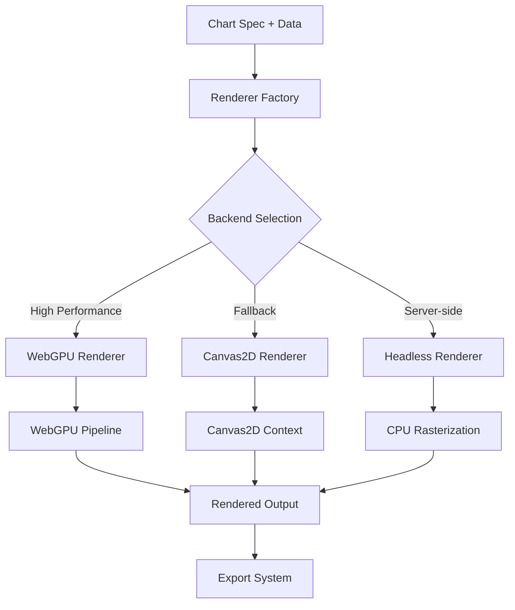

# Rendering System Design

**Status:** Planning → Implementation Required  
**Owner:** Core Rendering Team  
**Last Updated:** 2025-09-21  
**Lines:** 287

## Overview

The Rendering System is the core visualization engine responsible for transforming chart specifications and data into rendered graphics. It supports multiple backends (WebGPU, Canvas2D, Headless) with a unified interface for consistent rendering across platforms.

## Architecture



## Key Components

### 1. Renderer Trait
```rust
pub trait Renderer: Send + Sync {
    /// Render chart specification with data to internal format
    fn render_chart(&self, spec: &ChartSpec, data: &DataFrame) -> Result<RenderedChart, RenderError>;
    
    /// Get supported chart types for this renderer
    fn supported_chart_types(&self) -> &[MarkType];
    
    /// Check if renderer is available on current platform
    fn is_available(&self) -> bool;
    
    /// Get renderer capabilities and limitations
    fn capabilities(&self) -> RendererCapabilities;
}
```

### 2. WebGPU Renderer (Primary Backend)
- **Purpose**: High-performance GPU-accelerated rendering
- **Use Cases**: Interactive charts, large datasets (>10K points), real-time updates
- **Features**: Shader-based rendering, geometry instancing, compute shaders for data processing

**Key Implementation Details:**
```rust
pub struct WebGpuRenderer {
    device: Arc<wgpu::Device>,
    queue: Arc<wgpu::Queue>,
    pipeline_cache: HashMap<String, wgpu::RenderPipeline>,
    buffer_pool: BufferPool,
    shader_manager: ShaderManager,
}

impl WebGpuRenderer {
    /// Create optimized render pipeline for chart type
    fn create_render_pipeline(&self, chart_type: MarkType) -> wgpu::RenderPipeline {
        match chart_type {
            MarkType::Bar => self.create_bar_pipeline(),
            MarkType::Line => self.create_line_pipeline(),
            MarkType::Point => self.create_point_pipeline(),
            // ...
        }
    }
    
    /// Efficient batch rendering for multiple charts
    fn render_batch(&self, charts: &[ChartRenderRequest]) -> Result<Vec<RenderedChart>, RenderError> {
        // Batch rendering implementation for performance
    }
}
```

### 3. Canvas2D Renderer (Fallback Backend)  
- **Purpose**: Compatibility fallback when WebGPU unavailable
- **Use Cases**: Older browsers, limited hardware, simple charts
- **Features**: HTML5 Canvas API, client-side rendering, broad compatibility

### 4. Headless Renderer (Server-side)
- **Purpose**: Server-side chart generation without display context
- **Use Cases**: PDF generation, image exports, automated reporting
- **Features**: CPU-based rasterization, no GPU dependencies

## Data Flow

### 1. Input Processing
```rust
// Chart specification validation
let validated_spec = ChartSpecValidator::validate(spec)?;

// Data preparation and type inference
let processed_data = DataProcessor::prepare(data, &validated_spec)?;

// Encoding resolution (x/y mappings, colors, etc.)
let resolved_encoding = EncodingResolver::resolve(&validated_spec, &processed_data)?;
```

### 2. Geometry Generation
```rust
// Convert data points to screen coordinates
let screen_coords = self.data_to_screen_coords(&processed_data, &validated_spec.viewport)?;

// Generate geometry (vertices, indices) for chart type
let geometry = match validated_spec.mark {
    MarkType::Bar => BarGeometry::generate(&screen_coords, &style),
    MarkType::Line => LineGeometry::generate(&screen_coords, &style),
    // ...
};
```

### 3. Rendering Pipeline
```rust
// Create or reuse render pass
let mut render_pass = self.create_render_pass(&validated_spec)?;

// Set appropriate pipeline and resources
render_pass.set_pipeline(&pipeline);
render_pass.set_vertex_buffer(0, geometry.vertex_buffer.slice(..));
render_pass.set_index_buffer(geometry.index_buffer.slice(..), IndexFormat::Uint16);

// Execute draw commands
render_pass.draw_indexed(0..geometry.index_count, 0, 0..1);
```

## Performance Optimizations

### 1. Buffer Management
- **Buffer Pooling**: Reuse vertex/index buffers across renders
- **Memory Alignment**: Optimize buffer layouts for GPU cache efficiency
- **Batch Allocation**: Minimize buffer allocation/deallocation overhead

### 2. Pipeline Caching
- **Shader Compilation**: Cache compiled shaders across chart instances
- **Pipeline States**: Reuse render pipelines for similar chart configurations
- **Lazy Loading**: Load pipelines on-demand based on chart types used

### 3. Data Processing
- **SIMD Operations**: Use SIMD for coordinate transformations
- **Compute Shaders**: GPU-accelerated data preprocessing for large datasets
- **Streaming**: Process large datasets in chunks to manage memory usage

### 4. Culling and LOD
- **Viewport Culling**: Skip rendering points outside visible area
- **Level of Detail**: Reduce geometry complexity based on zoom level
- **Adaptive Sampling**: Intelligently sample large datasets for visualization

## Error Handling

### Error Types
```rust
#[derive(Debug, thiserror::Error)]
pub enum RenderError {
    #[error("WebGPU device not available")]
    DeviceNotAvailable,
    
    #[error("Unsupported chart type: {0:?}")]
    UnsupportedChartType(MarkType),
    
    #[error("Invalid data format: {0}")]
    InvalidDataFormat(String),
    
    #[error("Shader compilation failed: {0}")]
    ShaderCompilation(String),
    
    #[error("Render pipeline creation failed: {0}")]
    PipelineCreation(String),
    
    #[error("Out of GPU memory")]
    OutOfMemory,
}
```

### Fallback Strategy
```rust
impl RendererFactory {
    pub fn create_best_available() -> Box<dyn Renderer> {
        if WebGpuRenderer::is_available() {
            Box::new(WebGpuRenderer::new())
        } else if Canvas2DRenderer::is_available() {
            Box::new(Canvas2DRenderer::new())
        } else {
            Box::new(HeadlessRenderer::new())
        }
    }
}
```

## Integration Points

### 1. Chart Specification System
- Receives validated chart specifications
- Resolves encoding mappings to visual properties
- Handles styling and theming directives

### 2. Data Processing Pipeline
- Consumes processed DataFrame from data pipeline
- Applies coordinate transformations and projections
- Handles data aggregation and filtering for visualization

### 3. Export System
- Provides rendered output in various formats
- Supports texture-to-image conversion
- Enables vector format generation (SVG)

### 4. Interactive Features
- Exposes hit-testing for pointer events
- Provides data point selection capabilities
- Supports zoom/pan transformations

## Testing Strategy

### 1. Unit Tests
- **Renderer Backend Tests**: Test each renderer implementation independently
- **Geometry Generation**: Validate coordinate transformations and geometry creation
- **Error Handling**: Test error conditions and fallback behavior

### 2. Integration Tests
- **End-to-End Rendering**: Full pipeline from spec to rendered output
- **Cross-Backend Consistency**: Ensure consistent output across all backends
- **Performance Regression**: Benchmark tests for performance monitoring

### 3. Visual Testing
- **Image Comparison**: Compare rendered outputs against reference images
- **Cross-Platform Testing**: Validate rendering on different GPU vendors
- **Accessibility Testing**: Test screen reader compatibility and color contrast

## Security Considerations

### 1. Input Validation
- Validate all chart specifications and data inputs
- Prevent shader injection through user-controlled strings
- Limit resource allocation to prevent DoS attacks

### 2. Resource Management
- Implement limits on buffer sizes and shader complexity
- Monitor GPU memory usage to prevent system exhaustion
- Sandbox shader compilation and execution

### 3. Data Privacy
- Ensure data doesn't leak through error messages
- Implement secure deletion of GPU buffers
- Audit data access patterns for compliance requirements

## Future Enhancements

### 1. Advanced Rendering Features
- **3D Chart Types**: Surface plots, 3D scatter plots
- **Animation System**: Smooth transitions and data updates
- **Advanced Shading**: PBR materials, lighting effects

### 2. Performance Improvements  
- **Multi-threaded Rendering**: Parallel geometry generation
- **Streaming Updates**: Incremental data updates without full re-render
- **Compressed Textures**: Reduced memory usage for large datasets

### 3. Platform Support
- **Mobile Optimization**: Touch-specific interactions and performance tuning
- **WebXR Integration**: VR/AR chart visualization
- **Native Desktop**: Direct GPU access for maximum performance

## API Examples

### Basic Chart Rendering
```rust
let renderer = WebGpuRenderer::new()?;
let chart = renderer.render_chart(&chart_spec, &dataframe)?;
```

### Batch Rendering
```rust
let charts = vec![
    ChartRenderRequest::new(&spec1, &data1),
    ChartRenderRequest::new(&spec2, &data2),
];
let results = renderer.render_batch(&charts)?;
```

### Custom Styling
```rust
let style = ChartStyle::builder()
    .background_color(Color::WHITE)
    .grid_color(Color::LIGHT_GRAY)
    .build();
    
let chart = renderer.render_chart_with_style(&spec, &data, &style)?;
```

## References

- [WebGPU Specification](https://gpuweb.github.io/gpuweb/)
- [wgpu Rust Library](https://github.com/gfx-rs/wgpu)
- [HTML Canvas API](https://developer.mozilla.org/en-US/docs/Web/API/Canvas_API)
- [Visualization Grammar of Graphics](https://www.springer.com/gp/book/9780387245447)
