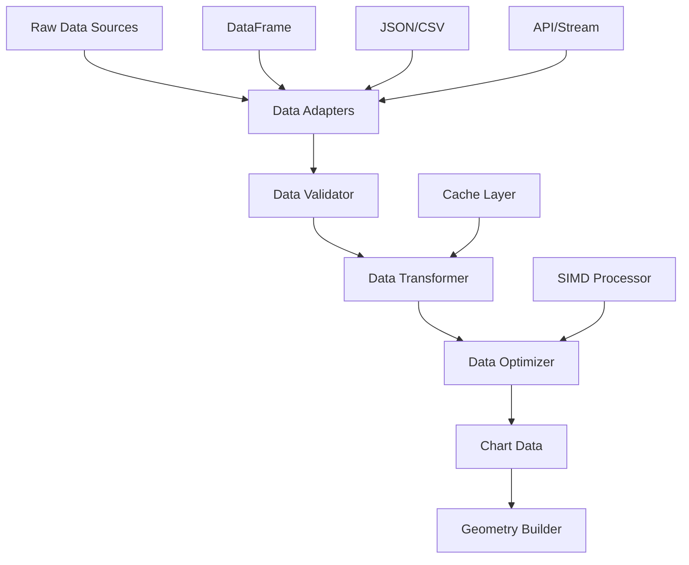

# Data Processing Pipeline Design
**Status**: 📋 Planned
**Owner**: Data Engineer
**Complexity**: Medium
**Lines of Code Target**: <300 per file

## Overview

The data processing pipeline transforms raw data from various sources into chart-ready formats optimized for GPU rendering. It provides type-safe data validation, transformation, and optimization.

## Architecture



## Core Components

### 1. Data Sources (`data_sources.rs` <200 lines)
**Responsibility**: Unified interface for different data inputs

```rust
#[derive(Debug, Clone)]
pub enum DataSource {
    DataFrame(DataFrame),
    Json(serde_json::Value),
    Csv { content: String, delimiter: char },
    Url { url: String, format: DataFormat },
    Stream { stream_id: String },
}

pub trait DataAdapter {
    type Output;
    type Error;

    async fn load(&self) -> Result<Self::Output, Self::Error>;
    fn validate_schema(&self) -> Result<DataSchema, ValidationError>;
}

pub struct DataFrameAdapter {
    df: DataFrame,
}

impl DataAdapter for DataFrameAdapter {
    type Output = ProcessedData;
    type Error = DataError;

    async fn load(&self) -> Result<ProcessedData, DataError> {
        // Convert DataFrame to internal format
        let columns = self.df.get_column_names();
        let mut processed = ProcessedData::new();

        for col_name in columns {
            let column = self.df.column(col_name)?;
            let processed_col = self.convert_column(column)?;
            processed.add_column(col_name.to_string(), processed_col);
        }

        Ok(processed)
    }

    fn validate_schema(&self) -> Result<DataSchema, ValidationError> {
        // Validate DataFrame structure for chart compatibility
        DataSchema::infer_from_dataframe(&self.df)
    }
}
```

### 2. Data Validation (`validator.rs` <250 lines)
**Responsibility**: Ensure data integrity and chart compatibility

```rust
#[derive(Debug, Clone)]
pub struct DataSchema {
    pub columns: HashMap<String, ColumnType>,
    pub row_count: usize,
    pub has_nulls: bool,
    pub constraints: Vec<DataConstraint>,
}

#[derive(Debug, Clone, PartialEq)]
pub enum ColumnType {
    Numeric { min: f64, max: f64, has_nulls: bool },
    Categorical { categories: HashSet<String>, has_nulls: bool },
    Temporal { format: Option<String>, has_nulls: bool },
    Text { max_length: usize, has_nulls: bool },
}

#[derive(Debug, Clone)]
pub enum DataConstraint {
    NonNull(String),                    // Column must not have nulls
    Range { column: String, min: f64, max: f64 },  // Numeric range
    Cardinality { column: String, max_categories: usize }, // Max unique values
    Relationship { x_col: String, y_col: String, relationship: RelationshipType },
}

pub struct DataValidator {
    schema: DataSchema,
    rules: Vec<ValidationRule>,
}

impl DataValidator {
    pub fn new(schema: DataSchema) -> Self {
        Self {
            schema,
            rules: Self::default_validation_rules(),
        }
    }

    pub fn validate(&self, data: &ProcessedData) -> Result<ValidationReport, ValidationError> {
        let mut report = ValidationReport::new();

        // Schema validation
        self.validate_schema(data, &mut report)?;

        // Data quality checks
        self.validate_quality(data, &mut report)?;

        // Chart-specific validations
        self.validate_chart_compatibility(data, &mut report)?;

        Ok(report)
    }

    fn validate_schema(&self, data: &ProcessedData, report: &mut ValidationReport) -> Result<(), ValidationError> {
        // Check column existence and types
        for (col_name, expected_type) in &self.schema.columns {
            let column = data.get_column(col_name)
                .ok_or_else(|| ValidationError::MissingColumn(col_name.clone()))?;

            if !self.types_compatible(&column.data_type(), expected_type) {
                report.add_error(ValidationError::TypeMismatch {
                    column: col_name.clone(),
                    expected: expected_type.clone(),
                    actual: column.data_type(),
                });
            }
        }

        Ok(())
    }

    fn validate_chart_compatibility(&self, data: &ProcessedData, report: &mut ValidationReport) -> Result<(), ValidationError> {
        // Ensure data can be rendered effectively
        if data.row_count() > 1_000_000 {
            report.add_warning(ValidationWarning::LargeDataset {
                row_count: data.row_count(),
                recommendation: "Consider data sampling or aggregation".to_string(),
            });
        }

        // Check for too many categories in categorical columns
        for (col_name, column) in data.columns() {
            if let ColumnData::Categorical(cat_data) = &column.data {
                if cat_data.unique_count() > 50 {
                    report.add_warning(ValidationWarning::HighCardinality {
                        column: col_name.clone(),
                        cardinality: cat_data.unique_count(),
                        recommendation: "Consider grouping rare categories".to_string(),
                    });
                }
            }
        }

        Ok(())
    }
}
```

### 3. Data Transformation (`transformer.rs` <250 lines)
**Responsibility**: Convert and optimize data for rendering

```rust
pub struct DataTransformer {
    transformations: Vec<Box<dyn Transformation>>,
    cache: Option<TransformCache>,
}

pub trait Transformation {
    fn apply(&self, data: &ProcessedData) -> Result<ProcessedData, TransformError>;
    fn is_cacheable(&self) -> bool { false }
    fn cache_key(&self) -> Option<String> { None }
}

// Common transformations
pub struct AggregationTransform {
    pub group_by: Vec<String>,
    pub aggregations: HashMap<String, AggregationType>,
}

#[derive(Debug, Clone)]
pub enum AggregationType {
    Sum,
    Mean,
    Count,
    Min,
    Max,
    Median,
    Percentile(f64),
}

impl Transformation for AggregationTransform {
    fn apply(&self, data: &ProcessedData) -> Result<ProcessedData, TransformError> {
        let mut result = ProcessedData::new();

        // Group data by specified columns
        let groups = data.group_by(&self.group_by)?;

        // Apply aggregations
        for (group_key, group_data) in groups {
            let mut aggregated_row = HashMap::new();

            // Add grouping columns
            for (i, col_name) in self.group_by.iter().enumerate() {
                aggregated_row.insert(col_name.clone(), group_key[i].clone());
            }

            // Apply aggregation functions
            for (col_name, agg_type) in &self.aggregations {
                let column = group_data.get_column(col_name)?;
                let aggregated_value = self.aggregate_column(column, agg_type)?;
                aggregated_row.insert(format!("{}_{:?}", col_name, agg_type), aggregated_value);
            }

            result.add_row(aggregated_row)?;
        }

        Ok(result)
    }

    fn is_cacheable(&self) -> bool { true }

    fn cache_key(&self) -> Option<String> {
        Some(format!("agg_{}_{:?}", self.group_by.join(","), self.aggregations))
    }
}

// Filtering transformation
pub struct FilterTransform {
    pub conditions: Vec<FilterCondition>,
}

#[derive(Debug, Clone)]
pub enum FilterCondition {
    Equals { column: String, value: DataValue },
    Range { column: String, min: f64, max: f64 },
    Contains { column: String, substring: String },
    NotNull { column: String },
    Custom { predicate: String }, // SQL-like expression
}

impl Transformation for FilterTransform {
    fn apply(&self, data: &ProcessedData) -> Result<ProcessedData, TransformError> {
        let mut result = data.clone();

        for condition in &self.conditions {
            result = self.apply_condition(&result, condition)?;
        }

        Ok(result)
    }
}
```

### 4. Data Optimization (`optimizer.rs` <200 lines)
**Responsibility**: Prepare data for high-performance rendering

```rust
pub struct DataOptimizer {
    pub simd_enabled: bool,
    pub sampling_strategy: Option<SamplingStrategy>,
    pub compression: Option<CompressionType>,
}

#[derive(Debug, Clone)]
pub enum SamplingStrategy {
    Uniform { sample_size: usize },
    Stratified { strata_column: String, samples_per_stratum: usize },
    Adaptive { target_density: f64 },
    LargestTriangleThreeBuckets { n_out: usize }, // For line charts
}

#[derive(Debug, Clone)]
pub enum CompressionType {
    RunLength,    // For categorical data
    DeltaEncoding, // For time series
    Quantization { levels: u8 }, // Reduce precision
}

impl DataOptimizer {
    pub fn optimize(&self, data: &ProcessedData) -> Result<OptimizedData, OptimizationError> {
        let mut optimized = OptimizedData::from(data);

        // Apply sampling if data is too large
        if let Some(strategy) = &self.sampling_strategy {
            if data.row_count() > strategy.threshold() {
                optimized = self.apply_sampling(optimized, strategy)?;
            }
        }

        // SIMD optimization for numeric columns
        if self.simd_enabled {
            optimized = self.apply_simd_optimization(optimized)?;
        }

        // Data compression
        if let Some(compression) = &self.compression {
            optimized = self.apply_compression(optimized, compression)?;
        }

        Ok(optimized)
    }

    #[cfg(target_arch = "x86_64")]
    fn apply_simd_optimization(&self, mut data: OptimizedData) -> Result<OptimizedData, OptimizationError> {
        use std::simd::*;

        // Vectorize numeric operations
        for (col_name, column) in data.numeric_columns_mut() {
            if let ColumnData::Numeric(values) = &mut column.data {
                // Process in chunks of 4 (f32x4)
                let chunks = values.chunks_exact_mut(4);
                let remainder = chunks.remainder();

                for chunk in chunks {
                    let simd_values = f32x4::from_slice(chunk);
                    // Apply SIMD operations (normalization, scaling, etc.)
                    let processed = simd_values * f32x4::splat(1.0); // Placeholder
                    processed.copy_to_slice(chunk);
                }

                // Handle remainder
                for value in remainder {
                    *value = *value * 1.0; // Placeholder
                }
            }
        }

        Ok(data)
    }

    fn apply_sampling(&self, data: OptimizedData, strategy: &SamplingStrategy) -> Result<OptimizedData, OptimizationError> {
        match strategy {
            SamplingStrategy::Uniform { sample_size } => {
                self.uniform_sampling(data, *sample_size)
            },
            SamplingStrategy::LargestTriangleThreeBuckets { n_out } => {
                self.lttb_sampling(data, *n_out)
            },
            _ => Ok(data), // TODO: Implement other strategies
        }
    }

    // Largest-Triangle-Three-Buckets algorithm for time series downsampling
    fn lttb_sampling(&self, data: OptimizedData, n_out: usize) -> Result<OptimizedData, OptimizationError> {
        if data.row_count() <= n_out {
            return Ok(data);
        }

        let bucket_size = (data.row_count() - 2) as f64 / (n_out - 2) as f64;
        let mut sampled_indices = Vec::with_capacity(n_out);

        // Always include first point
        sampled_indices.push(0);

        // LTTB algorithm implementation
        let mut a = 0;
        for i in 1..(n_out - 1) {
            let avg_x = bucket_size * (i as f64 + 1.0);
            let bucket_start = ((bucket_size * i as f64) + 1.0).floor() as usize;
            let bucket_end = ((bucket_size * (i + 1) as f64) + 1.0).floor() as usize;

            // Find point with largest triangle area
            let mut max_area = 0.0;
            let mut max_area_point = bucket_start;

            for j in bucket_start..bucket_end {
                let area = self.triangle_area(
                    data.get_point(a)?,
                    data.get_point(j)?,
                    (avg_x, data.bucket_average_y(bucket_end, data.row_count())?)
                );

                if area > max_area {
                    max_area = area;
                    max_area_point = j;
                }
            }

            sampled_indices.push(max_area_point);
            a = max_area_point;
        }

        // Always include last point
        sampled_indices.push(data.row_count() - 1);

        Ok(data.select_rows(&sampled_indices)?)
    }
}
```

### 5. Chart Data Format (`chart_data.rs` <150 lines)
**Responsibility**: GPU-optimized data structure for rendering

```rust
/// Optimized data structure for GPU rendering
#[derive(Debug, Clone)]
pub struct ChartData {
    pub points: Vec<DataPoint>,
    pub metadata: DataMetadata,
    pub statistics: DataStatistics,
}

#[derive(Debug, Clone, Copy)]
#[repr(C)]
pub struct DataPoint {
    pub x: f32,
    pub y: f32,
    pub color: [f32; 4], // RGBA
    pub size: f32,
    pub category: u32,   // For categorical coloring
}

unsafe impl bytemuck::Pod for DataPoint {}
unsafe impl bytemuck::Zeroable for DataPoint {}

#[derive(Debug, Clone)]
pub struct DataMetadata {
    pub x_column: String,
    pub y_column: String,
    pub color_column: Option<String>,
    pub size_column: Option<String>,
    pub x_type: ColumnType,
    pub y_type: ColumnType,
}

#[derive(Debug, Clone)]
pub struct DataStatistics {
    pub x_range: (f32, f32),
    pub y_range: (f32, f32),
    pub point_count: usize,
    pub null_count: usize,
    pub categories: Vec<String>,
}

impl ChartData {
    /// Convert from ProcessedData to GPU-friendly format
    pub fn from_processed(
        data: &ProcessedData,
        x_col: &str,
        y_col: &str,
        color_col: Option<&str>,
        size_col: Option<&str>
    ) -> Result<Self, ConversionError> {
        let x_values = data.get_column(x_col)?;
        let y_values = data.get_column(y_col)?;

        let mut points = Vec::with_capacity(data.row_count());
        let mut x_min = f32::INFINITY;
        let mut x_max = f32::NEG_INFINITY;
        let mut y_min = f32::INFINITY;
        let mut y_max = f32::NEG_INFINITY;

        for i in 0..data.row_count() {
            let x = x_values.get_as_f32(i)?;
            let y = y_values.get_as_f32(i)?;

            x_min = x_min.min(x);
            x_max = x_max.max(x);
            y_min = y_min.min(y);
            y_max = y_max.max(y);

            let color = if let Some(color_col) = color_col {
                let color_value = data.get_column(color_col)?.get_as_f32(i)?;
                Self::value_to_color(color_value, 0.0, 1.0) // Normalized color
            } else {
                [0.2, 0.6, 0.8, 1.0] // Default blue
            };

            let size = if let Some(size_col) = size_col {
                data.get_column(size_col)?.get_as_f32(i)?
            } else {
                1.0 // Default size
            };

            points.push(DataPoint {
                x, y, color, size,
                category: 0, // TODO: Handle categorical data
            });
        }

        let statistics = DataStatistics {
            x_range: (x_min, x_max),
            y_range: (y_min, y_max),
            point_count: points.len(),
            null_count: 0, // TODO: Count nulls during processing
            categories: vec![], // TODO: Extract categories
        };

        Ok(ChartData {
            points,
            metadata: DataMetadata {
                x_column: x_col.to_string(),
                y_column: y_col.to_string(),
                color_column: color_col.map(|s| s.to_string()),
                size_column: size_col.map(|s| s.to_string()),
                x_type: x_values.data_type(),
                y_type: y_values.data_type(),
            },
            statistics,
        })
    }

    fn value_to_color(value: f32, min: f32, max: f32) -> [f32; 4] {
        // Map value to color gradient
        let normalized = (value - min) / (max - min);
        [
            normalized,           // Red
            0.5,                 // Green
            1.0 - normalized,    // Blue
            1.0,                 // Alpha
        ]
    }
}
```

## Error Handling

```rust
#[derive(Debug, thiserror::Error)]
pub enum DataError {
    #[error("Column not found: {0}")]
    ColumnNotFound(String),

    #[error("Type conversion error: {0}")]
    TypeConversion(String),

    #[error("Validation failed: {0}")]
    Validation(#[from] ValidationError),

    #[error("Transform error: {0}")]
    Transform(#[from] TransformError),

    #[error("Polars error: {0}")]
    Polars(#[from] polars::error::PolarsError),
}
```

## Performance Targets

- Process 1M rows in <1 second
- SIMD acceleration for numeric operations
- <100MB memory usage for typical datasets
- Lazy evaluation where possible
- Efficient sampling for large datasets

## File Structure

```
helios-core/src/data/
├── mod.rs              # Public API exports
├── sources.rs          # Data source adapters (<200 lines)
├── validator.rs        # Data validation (<250 lines)
├── transformer.rs      # Data transformations (<250 lines)
├── optimizer.rs        # Performance optimization (<200 lines)
├── chart_data.rs       # GPU-friendly format (<150 lines)
└── errors.rs           # Error types (<100 lines)
```

Total: ~1,150 lines across 7 files (average 164 lines per file)
