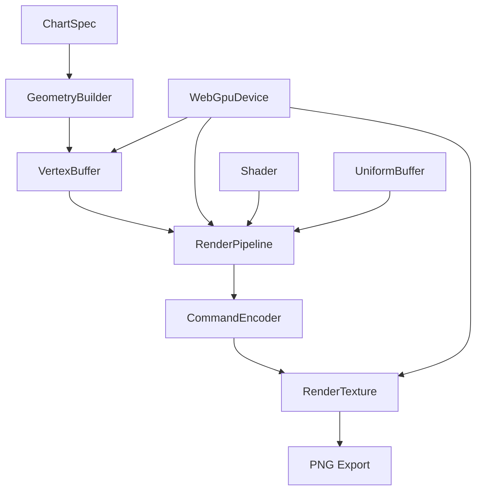

# WebGPU Renderer Design
**Status**: 📋 Planned
**Owner**: Graphics Engineer
**Complexity**: High
**Lines of Code Target**: <300 per file

## Overview

The WebGPU renderer is the high-performance rendering backend for Leptos Helios. It provides GPU-accelerated chart rendering with modern graphics pipeline capabilities.

## Architecture



## Core Components

### 1. Device Management (`device.rs` <150 lines)
**Responsibility**: WebGPU device lifecycle and capabilities

```rust
pub struct WebGpuDevice {
    device: Device,
    queue: Queue,
    adapter_info: AdapterInfo,
}

impl WebGpuDevice {
    /// Initialize WebGPU device with fallback strategy
    pub async fn new() -> Result<Self, WebGpuError>;

    /// Check if specific features are supported
    pub fn supports_feature(&self, feature: Features) -> bool;

    /// Create buffer with validation
    pub fn create_buffer(&self, desc: &BufferDescriptor) -> Buffer;

    /// Create texture for offscreen rendering
    pub fn create_render_texture(&self, width: u32, height: u32) -> Texture;
}
```

**Key Features**:
- Graceful fallback if WebGPU unavailable
- Feature detection and capability checking
- Memory management and resource pooling
- Error handling with context

### 2. Render Pipeline (`pipeline.rs` <200 lines)
**Responsibility**: GPU rendering pipeline configuration

```rust
pub struct ChartPipeline {
    pipeline: RenderPipeline,
    bind_group_layout: BindGroupLayout,
    vertex_buffer_layout: VertexBufferLayout,
}

impl ChartPipeline {
    /// Create pipeline for specific chart type
    pub fn new(device: &WebGpuDevice, chart_type: ChartType) -> Result<Self>;

    /// Update pipeline for different data sizes
    pub fn reconfigure(&mut self, vertex_count: u32) -> Result<()>;

    /// Bind resources for rendering
    pub fn bind_resources(&self, pass: &mut RenderPass, uniforms: &UniformBuffer);
}
```

**Pipeline Types**:
- `BarChartPipeline`: Rectangle-based rendering
- `LineChartPipeline`: Line strip rendering
- `ScatterPipeline`: Point-based rendering
- `AreaChartPipeline`: Filled polygon rendering

### 3. Geometry Generation (`geometry.rs` <250 lines)
**Responsibility**: Convert chart data to GPU vertices

```rust
pub trait GeometryBuilder {
    type Vertex: bytemuck::Pod + bytemuck::Zeroable;

    fn build_vertices(&self, data: &ChartData, viewport: &Viewport) -> Vec<Self::Vertex>;
    fn build_indices(&self, vertex_count: u32) -> Vec<u32>;
}

pub struct BarGeometryBuilder {
    bar_width: f32,
    spacing: f32,
    colors: ColorPalette,
}

impl GeometryBuilder for BarGeometryBuilder {
    type Vertex = BarVertex;

    fn build_vertices(&self, data: &ChartData, viewport: &Viewport) -> Vec<BarVertex> {
        // Convert data points to screen-space rectangles
        // Handle coordinate system transformations
        // Apply colors and styling
    }
}
```

**Vertex Types**:
```rust
#[repr(C)]
#[derive(Copy, Clone, Debug, bytemuck::Pod, bytemuck::Zeroable)]
pub struct BarVertex {
    position: [f32; 2],    // Screen coordinates
    color: [f32; 4],       // RGBA color
    tex_coords: [f32; 2],  // For texturing/patterns
}

#[repr(C)]
#[derive(Copy, Clone, Debug, bytemuck::Pod, bytemuck::Zeroable)]
pub struct LineVertex {
    position: [f32; 2],
    color: [f32; 4],
    thickness: f32,
    _padding: [f32; 3],    // Alignment
}
```

### 4. Shader System (`shaders/` directory)

#### Bar Chart Shader (`bar_chart.wgsl` <100 lines)
```wgsl
struct Uniforms {
    viewport_size: vec2<f32>,
    transform: mat4x4<f32>,
}

struct VertexInput {
    @location(0) position: vec2<f32>,
    @location(1) color: vec4<f32>,
    @location(2) tex_coords: vec2<f32>,
}

struct VertexOutput {
    @builtin(position) clip_position: vec4<f32>,
    @location(0) color: vec4<f32>,
    @location(1) tex_coords: vec2<f32>,
}

@group(0) @binding(0)
var<uniform> uniforms: Uniforms;

@vertex
fn vs_main(input: VertexInput) -> VertexOutput {
    var out: VertexOutput;

    // Transform to clip space
    let world_pos = vec4<f32>(input.position, 0.0, 1.0);
    out.clip_position = uniforms.transform * world_pos;

    out.color = input.color;
    out.tex_coords = input.tex_coords;

    return out;
}

@fragment
fn fs_main(in: VertexOutput) -> @location(0) vec4<f32> {
    // Basic solid color rendering
    return in.color;
}
```

### 5. Renderer Controller (`renderer.rs` <250 lines)
**Responsibility**: Orchestrate rendering process

```rust
pub struct WebGpuRenderer {
    device: WebGpuDevice,
    pipelines: HashMap<ChartType, Box<dyn ChartPipeline>>,
    geometry_builders: HashMap<ChartType, Box<dyn GeometryBuilder>>,
    uniform_buffer: UniformBuffer,
}

impl WebGpuRenderer {
    pub async fn new() -> Result<Self, RendererError>;

    /// Render chart to texture
    pub async fn render_chart(
        &mut self,
        spec: &ChartSpec,
        data: &DataFrame
    ) -> Result<RenderTexture, RendererError> {
        // 1. Validate inputs
        self.validate_spec(spec)?;

        // 2. Select appropriate pipeline
        let pipeline = self.pipelines.get(&spec.mark)
            .ok_or(RendererError::UnsupportedChartType)?;

        // 3. Generate geometry
        let builder = self.geometry_builders.get(&spec.mark).unwrap();
        let vertices = builder.build_vertices(data, &spec.viewport)?;

        // 4. Upload to GPU
        let vertex_buffer = self.device.create_vertex_buffer(&vertices);
        self.uniform_buffer.update(&spec.viewport);

        // 5. Render
        let texture = self.device.create_render_texture(
            spec.config.width,
            spec.config.height
        );

        let mut encoder = self.device.create_command_encoder();
        {
            let mut render_pass = encoder.begin_render_pass(&texture);
            pipeline.bind_resources(&mut render_pass, &self.uniform_buffer);
            render_pass.set_vertex_buffer(0, vertex_buffer.slice(..));
            render_pass.draw(0..vertices.len() as u32, 0..1);
        }

        self.device.queue.submit([encoder.finish()]);

        Ok(RenderTexture::new(texture))
    }

    /// Export rendered texture to PNG
    pub async fn export_png(&self, texture: &RenderTexture) -> Result<Vec<u8>, RendererError>;
}
```

## Performance Optimizations

### 1. Buffer Pooling
```rust
pub struct BufferPool {
    vertex_buffers: VecDeque<Buffer>,
    index_buffers: VecDeque<Buffer>,
    max_size: usize,
}

impl BufferPool {
    pub fn acquire_vertex_buffer(&mut self, size: u64) -> Buffer;
    pub fn release_buffer(&mut self, buffer: Buffer);
}
```

### 2. Batch Rendering
```rust
pub struct RenderBatch {
    chart_type: ChartType,
    vertices: Vec<Vertex>,
    draw_calls: Vec<DrawCall>,
}

impl RenderBatch {
    pub fn add_chart(&mut self, chart_data: &ChartData);
    pub fn flush(&mut self, renderer: &mut WebGpuRenderer);
}
```

### 3. Instanced Rendering
For charts with many similar elements (scatter plots):
```rust
pub struct InstancedRenderer {
    instance_buffer: Buffer,
    max_instances: u32,
}

impl InstancedRenderer {
    pub fn draw_instanced(&self, pass: &mut RenderPass, instance_count: u32);
}
```

## Error Handling

```rust
#[derive(Debug, thiserror::Error)]
pub enum WebGpuError {
    #[error("WebGPU not supported")]
    NotSupported,

    #[error("Device creation failed: {0}")]
    DeviceCreation(String),

    #[error("Buffer allocation failed: {0}")]
    BufferAllocation(String),

    #[error("Shader compilation failed: {0}")]
    ShaderCompilation(String),

    #[error("Render pass failed: {0}")]
    RenderPass(String),
}
```

## Testing Strategy

### Unit Tests
- Device creation and feature detection
- Geometry generation correctness
- Shader compilation validation
- Buffer management

### Integration Tests
- End-to-end rendering pipeline
- Multiple chart types
- Performance benchmarks
- Memory leak detection

### Visual Tests
- Golden image comparison
- Cross-platform rendering consistency
- Browser compatibility

## File Structure

```
helios-core/src/webgpu/
├── device.rs              # WebGPU device management (<150 lines)
├── pipeline.rs            # Render pipeline setup (<200 lines)
├── geometry.rs            # Vertex generation (<250 lines)
├── renderer.rs            # Main renderer controller (<250 lines)
├── buffers.rs             # Buffer management (<150 lines)
├── errors.rs              # Error types (<100 lines)
└── shaders/
    ├── bar_chart.wgsl      # Bar chart shaders (<100 lines)
    ├── line_chart.wgsl     # Line chart shaders (<100 lines)
    ├── scatter_plot.wgsl   # Scatter plot shaders (<100 lines)
    └── common.wgsl         # Shared shader utilities (<150 lines)
```

## Dependencies

```toml
[dependencies]
wgpu = "0.32"              # Updated to latest
bytemuck = "1.0"           # Vertex data casting
pollster = "0.3"           # Async runtime for blocking
image = "0.24"             # PNG export
```

## Browser Compatibility

| Browser | Version | WebGPU Support | Status |
|---------|---------|----------------|---------|
| Chrome  | 113+    | ✅ Full        | Supported |
| Firefox | 110+    | ✅ Full        | Supported |
| Safari  | 16.4+   | ✅ Full        | Supported |
| Edge    | 113+    | ✅ Full        | Supported |

## Implementation Timeline

- **Week 1**: Device management and basic pipeline
- **Week 2**: Geometry generation and shaders
- **Week 3**: Renderer integration and testing
- **Week 4**: Performance optimization and polish

## Success Metrics

- Render 10K points at 60fps
- Memory usage <100MB for typical charts
- Compatible with 95% of modern browsers
- <5ms startup time for device initialization
